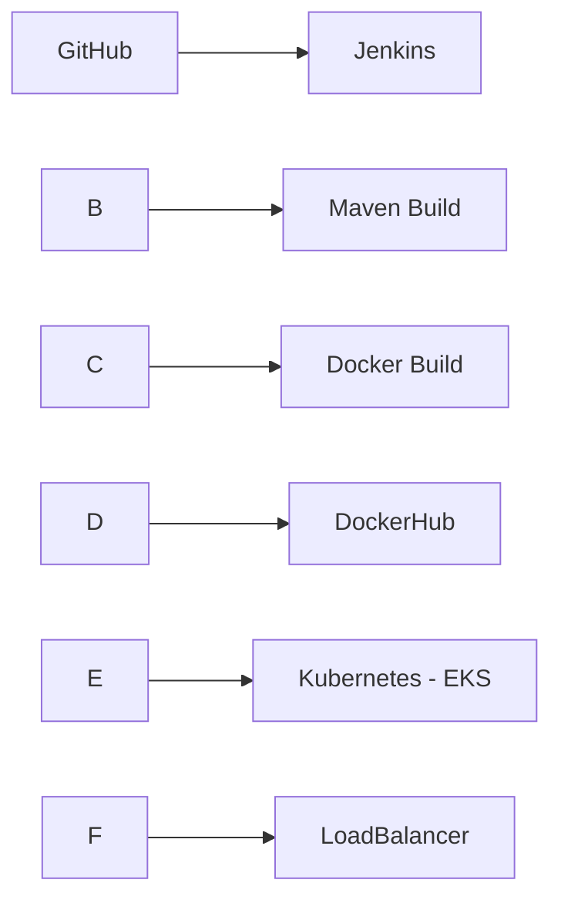

# demoapp-devops


\# 🚀 End-to-End DevOps CI/CD Pipeline (Jenkins + Docker + Kubernetes + AWS EKS)


!\[CI/CD](https://img.shields.io/badge/CI-CD%20Pipeline-blue)

!\[Docker](https://img.shields.io/badge/Docker-Containerization-blue)

!\[Kubernetes](https://img.shields.io/badge/Kubernetes-Orchestration-blue)

!\[AWS](https://img.shields.io/badge/AWS-EKS-orange)

!\[Jenkins](https://img.shields.io/badge/Jenkins-Automation-red)

!\[Status](https://img.shields.io/badge/Status-Production--Like-brightgreen)


\---


\## 📌 Project Overview


This project demonstrates a \*\*complete CI/CD pipeline\*\* that automates:


\* Building a Java application using Maven

\* Containerizing using Docker

\* Pushing image to DockerHub

\* Deploying to Kubernetes (AWS EKS)

\* Handling real-world failures and debugging


\---


\## 🏗️ Architecture





\---


\## 📂 Project Structure


```

demoapp-devops/

│── Dockerfile

│── pom.xml

│── deployment.yaml

│── service.yaml

│── Jenkinsfile

└── src/

```


\---


\## ⚙️ Jenkins Pipeline (Full Code)


```groovy

pipeline {

&#x20;   agent any


&#x20;   stages {


&#x20;       stage('Clone Code') {

&#x20;           steps {

&#x20;               git 'https://github.com/srikanthpalem/demoapp-devops.git'

&#x20;           }

&#x20;       }


&#x20;       stage('Deploy to EKS') {

&#x20;           steps {

&#x20;               withCredentials(\[string(credentialsId: 'aws-secret', variable: 'AWS\_SECRET\_ACCESS\_KEY')]) {

&#x20;                   bat '''

&#x20;                   set AWS\_ACCESS\_KEY\_ID=YOUR\_ACCESS\_KEY

&#x20;                   set AWS\_SECRET\_ACCESS\_KEY=%AWS\_SECRET\_ACCESS\_KEY%

&#x20;                   set AWS\_DEFAULT\_REGION=ap-south-1


&#x20;                   kubectl apply -f deployment.yaml

&#x20;                   kubectl apply -f service.yaml

&#x20;                   '''

&#x20;               }

&#x20;           }

&#x20;       }


&#x20;       stage('Build App') {

&#x20;           steps {

&#x20;               bat '''

&#x20;               set JAVA\_HOME=C:\\\\Program Files\\\\Eclipse Adoptium\\\\jdk-17

&#x20;               set PATH=%JAVA\_HOME%\\\\bin;C:\\\\apache-maven\\\\bin;%PATH%


&#x20;               mvn clean package -DskipTests

&#x20;               '''

&#x20;           }

&#x20;       }


&#x20;       stage('Build Docker Image') {

&#x20;           steps {

&#x20;               bat 'docker build -t srikanthpalem/demoapp:latest .'

&#x20;           }

&#x20;       }


&#x20;       stage('Push Docker Image') {

&#x20;           steps {

&#x20;               withCredentials(\[usernamePassword(credentialsId: 'dockerhub-creds', usernameVariable: 'USER', passwordVariable: 'PASS')]) {

&#x20;                   bat '''

&#x20;                   docker login -u %USER% -p %PASS%

&#x20;                   docker push srikanthpalem/demoapp:latest

&#x20;                   '''

&#x20;               }

&#x20;           }

&#x20;       }

&#x20;   }

}

```


\---


\## 🐳 Dockerfile


```dockerfile

FROM openjdk:17-jdk-slim

COPY target/demoapp-0.0.1-SNAPSHOT.jar app.jar

ENTRYPOINT \["java", "-jar", "/app.jar"]

```


\---


\## ☸️ Kubernetes Deployment


```yaml

apiVersion: apps/v1

kind: Deployment

metadata:

&#x20; name: demoapp

spec:

&#x20; replicas: 1

&#x20; selector:

&#x20;   matchLabels:

&#x20;     app: demoapp

&#x20; template:

&#x20;   metadata:

&#x20;     labels:

&#x20;       app: demoapp

&#x20;   spec:

&#x20;     containers:

&#x20;     - name: demoapp

&#x20;       image: srikanthpalem/demoapp:latest

&#x20;       ports:

&#x20;       - containerPort: 8082

```


\---


\## 🌐 Kubernetes Service


```yaml

apiVersion: v1

kind: Service

metadata:

&#x20; name: demoapp

spec:

&#x20; type: LoadBalancer

&#x20; selector:

&#x20;   app: demoapp

&#x20; ports:

&#x20;   - protocol: TCP

&#x20;     port: 8082

&#x20;     targetPort: 8082

```


\---


\## ☁️ AWS EKS Commands


\### Create Cluster


```bash

eksctl create cluster \\

\--name demo-cluster \\

\--region ap-south-1 \\

\--node-type t3.medium \\

\--nodes 1

```


\### Update kubeconfig


```bash

aws eks update-kubeconfig --region ap-south-1 --name demo-cluster

```


\### Delete Cluster (Cost Saving)


```bash

eksctl delete cluster --name demo-cluster --region ap-south-1

```


\---


\## 🔍 Deep Debugging Section (REAL ISSUES \& FIXES)


\### ❌ Issue 1: Jenkins → kubectl authentication error


```

error: executable aws not found

```


✅ Fix:


\* Installed AWS CLI in Jenkins machine

\* Added AWS credentials in pipeline


\---


\### ❌ Issue 2: kubectl not recognized


```

'kubectl' is not recognized

```


✅ Fix:


\* Installed kubectl

\* Added to PATH


\---


\### ❌ Issue 3: AWS Credentials Missing


```

Unable to locate credentials

```


✅ Fix:


```bash

set AWS\_ACCESS\_KEY\_ID=XXXX

set AWS\_SECRET\_ACCESS\_KEY=XXXX

set AWS\_DEFAULT\_REGION=ap-south-1

```


\---


\### ❌ Issue 4: Docker not running


```

failed to connect to docker engine

```


✅ Fix:


\* Started Docker Desktop

\* Verified:


```bash

docker ps

docker version

```


\---


\### ❌ Issue 5: Maven not found


```

mvn not recognized

```


✅ Fix:


\* Installed Maven

\* Added to PATH


\---


\### ❌ Issue 6: Dockerfile missing


```

failed to read dockerfile

```


✅ Fix:


\* Created Dockerfile in project root


\---


\### ❌ Issue 7: Pods stuck in Pending


```

0/1 nodes available: Too many pods

```


✅ Root Cause:


\* Node capacity exceeded


✅ Fix Options:


```bash

eksctl scale nodegroup \\

\--cluster demo-cluster \\

\--name demo-nodes \\

\--nodes 2 \\

\--nodes-max 3

```


OR


\* Upgraded instance to `t3.medium`


\---


\### ❌ Issue 8: Git clone failure


```

connection reset

```


✅ Fix:


\* Network issue resolved

\* Retried clone


\---


\## 🔍 Useful Debug Commands


```bash

kubectl get pods

kubectl describe pod <pod-name>

kubectl get nodes

kubectl logs <pod-name>

kubectl get svc

```


\---


\## 💰 Cost Optimization


\* Used minimal nodes

\* Deleted cluster after testing


\---


\## 📊 Final Outcome


✔ CI/CD pipeline successfully executed

✔ Application deployed on Kubernetes

✔ LoadBalancer exposed application

✔ Multiple real-world issues debugged


\---


\## 🚀 Future Improvements


\* Helm charts

\* Terraform for infra

\* Monitoring (Prometheus + Grafana)

\* Auto-scaling


\---


\## 👨‍💻 Author


\*\*Srikanth Palem\*\*


\---


\## ⭐ Support


If you like this project, give it a ⭐ on GitHub!


